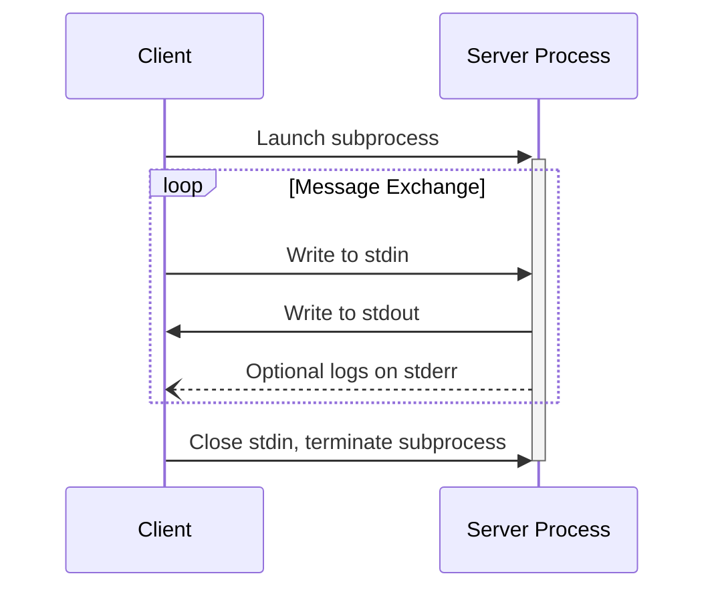
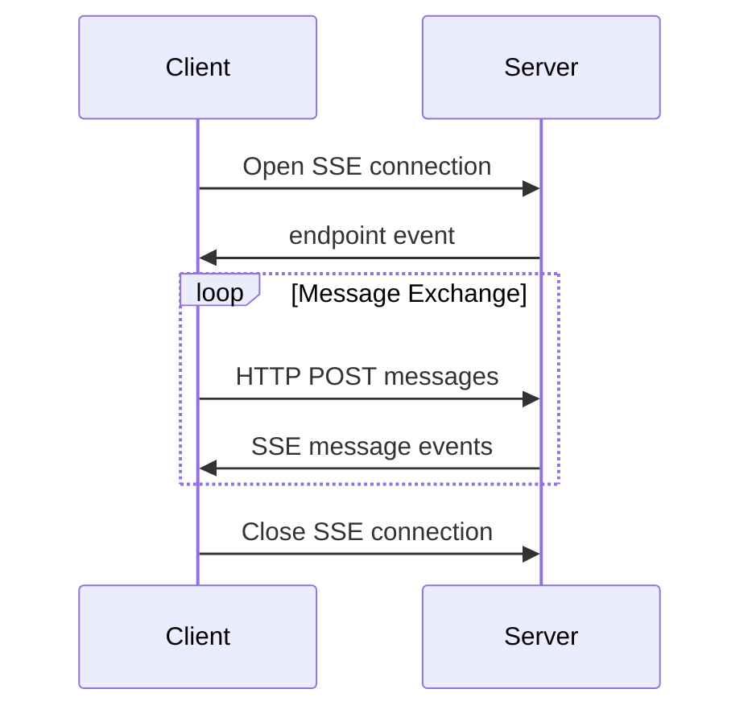
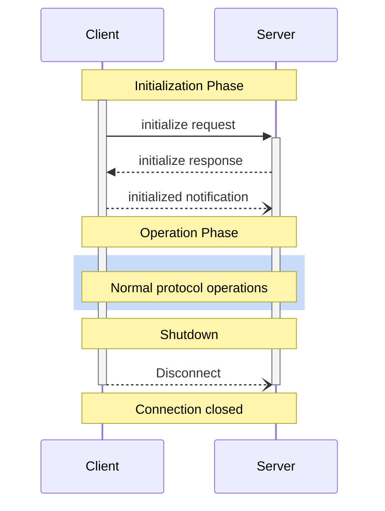

# Client Usage Guide

This guide covers the basic usage patterns for the Hermes MCP client.

## Client Lifecycle

Once properly configured in your application's supervision tree, the Hermes client automatically handles:

1. Initial connection to the server
2. Protocol version negotiation
3. Capability exchange
4. Handshake completion

For example, if you're using the `Hermes.Transport.STDIO` layer for your client, this flow would lloks like to:



Otherwise, if you're using the `Hermes.Transport.SSE` layer, the flow would look like this:



> ### Note {: .info}
>
> These sequence diagrams can be found on the official [MCP specification](https://spec.modelcontextprotocol.io/specification/2024-11-05/basic/transports/)

Generally speaking, the client <> server lifecycle on MCP can be summarized as:

1. **Initialization**: Capability negotiation and protocol version agreement
2. **Operation**: Normal protocol communication
3. **Shutdown**: Graceful termination of the connection



## Basic Operations

### Checking Connection Status

You can check if a server is responsive with the `ping/1` function:

```elixir
case Hermes.Client.ping(MyApp.MCPClient) do
  :pong -> IO.puts("Server is responsive")
  {:error, reason} -> IO.puts("Connection error: #{inspect(reason)}")
end
```

### Retrieving Server Information

After initialization, you can access the server's capabilities and information:

```elixir
# Get server capabilities
server_capabilities = Hermes.Client.get_server_capabilities(MyApp.MCPClient)
IO.inspect(server_capabilities, label: "Server capabilities")

# Get server version information
server_info = Hermes.Client.get_server_info(MyApp.MCPClient)
IO.inspect(server_info, label: "Server info")
```

## Working with Resources

### Listing Resources

To retrieve the list of available resources from the server:

```elixir
case Hermes.Client.list_resources(MyApp.MCPClient) do
  # this is an "application" error, from the server
  {:ok, %Hermes.MCP.Response{is_error: true}} ->
    IO.puts("Error listing resources")

  {:ok, %Hermes.MCP.Response{result: %{"resources" => resources}}} ->
    IO.puts("Available resources:")
    Enum.each(resources, fn resource ->
      IO.puts("  - #{resource["name"]} (#{resource["uri"]})")
    end)

  # this is a transport/protocol error
  {:error, %Hermes.MCP.Error{} = error} ->
    IO.puts("Error listing resources: #{inspect(error)}")
end
```

### Pagination

For large resource collections, you can use pagination with cursors:

```elixir
# First page
{:ok, %Hermes.MCP.Response{result: %{"resources" => resources, "nextCursor" => cursor}}} =
  Hermes.Client.list_resources(MyApp.MCPClient)

# Get next page if a cursor is available
if cursor do
  {:ok, %Hermes.MCP.Response{result: %{"resources" => more_resources}}} =
    Hermes.Client.list_resources(MyApp.MCPClient, cursor: cursor)
end
```

### Reading Resources

To read the contents of a specific resource:

```elixir
case Hermes.Client.read_resource(MyApp.MCPClient, "file:///example.txt") do
  # this is an "application" error, from the server
  {:ok, %Hermes.MCP.Response{is_error: true}} ->
    IO.puts("Error reading resources")

  {:ok, %Hermes.MCP.Response{result: %{"contents" => contents}}} ->
    Enum.each(contents, fn content ->
      case content do
        %{"text" => text} -> IO.puts("Text content: #{text}")
        %{"blob" => blob} -> IO.puts("Binary content: #{byte_size(blob)} bytes")
      end
    end)

  # this is a transport/protocol error
  {:error, error} ->
    IO.puts("Error reading resource: #{inspect(error)}")
end
```

## Working with Tools

### Listing Tools

To discover available tools:

```elixir
case Hermes.Client.list_tools(MyApp.MCPClient) do
  # this is an "application" error, from the server
  {:ok, %Hermes.MCP.Response{is_error: true}} ->
    IO.puts("Error listing tools")

  {:ok, %Hermes.MCP.Response{result: %{"tools" => tools}}} ->
    IO.puts("Available tools:")
    Enum.each(tools, fn tool ->
      IO.puts("  - #{tool["name"]}: #{tool["description"] || "No description"}")
    end)

  # this is a transport/protocol error
  {:error, error} ->
    IO.puts("Error listing tools: #{inspect(error)}")
end
```

### Calling Tools

To invoke a tool with arguments:

```elixir
tool_name = "calculate"
tool_args = %{"expression" => "2 + 2"}

case Hermes.Client.call_tool(MyApp.MCPClient, tool_name, tool_args) do
  # this is an "application" error, from the server
  {:ok, %Hermes.MCP.Response{is_error: true}} ->
    IO.puts("Tool execution error:")
    Enum.each(content, fn item ->
      case item do
        %{"type" => "text", "text" => text} -> IO.puts("  #{text}")
        _ -> IO.puts("  #{inspect(item)}")
      end
    end)

  {:ok, %Hermes.MCP.Response{result: %{"content" => content}}} ->
    IO.puts("Tool result:")
    Enum.each(content, fn item ->
      case item do
        %{"type" => "text", "text" => text} -> IO.puts("  #{text}")
        _ -> IO.puts("  #{inspect(item)}")
      end
    end)

  # this is a transport/protocol error
  {:error, error} ->
    IO.puts("Error calling tool: #{inspect(error)}")
end
```

## Working with Prompts

### Listing Prompts

To list available prompts:

```elixir
case Hermes.Client.list_prompts(MyApp.MCPClient) do
  # this is an "application" error, from the server
  {:ok, %Hermes.MCP.Response{is_error: true}} ->
    IO.puts("Error listing prompts")

  {:ok, %Hermes.MCP.Response{result: %{"prompts" => prompts}}} ->
    IO.puts("Available prompts:")
    Enum.each(prompts, fn prompt ->
      required_args = prompt["arguments"]
                      |> Enum.filter(& &1["required"])
                      |> Enum.map(& &1["name"])
                      |> Enum.join(", ")

      IO.puts("  - #{prompt["name"]}")
      IO.puts("    Required args: #{required_args}")
    end)

  # this is a transport/protocol error
  {:error, error} ->
    IO.puts("Error listing prompts: #{inspect(error)}")
end
```

### Getting Prompts

To retrieve a specific prompt with arguments:

```elixir
prompt_name = "code_review"
prompt_args = %{"code" => "def hello():\n    print('world')"}

case Hermes.Client.get_prompt(MyApp.MCPClient, prompt_name, prompt_args) do
  # this is an "application" error, from the server
  {:ok, %Hermes.MCP.Response{is_error: true}} ->
    IO.puts("Error getting prompt")

  {:ok, %Hermes.MCP.Response{result: %{"messages" => messages}}} ->
    IO.puts("Prompt messages:")
    Enum.each(messages, fn message ->
      role = message["role"]
      content = case message["content"] do
        %{"type" => "text", "text" => text} -> text
        _ -> inspect(message["content"])
      end

      IO.puts("  #{role}: #{content}")
    end)

  # this is a transport/protocol error
  {:error, error} ->
    IO.puts("Error getting prompt: #{inspect(error)}")
end
```

## Operation Structure

All client API calls use the `Hermes.Client.Operation` struct internally to standardize how requests are processed. This provides consistent handling of parameters, timeouts, and progress tracking.

```elixir
# Example of direct Operation usage (advanced)
operation = Hermes.Client.Operation.new(%{
  method: "tools/call",
  params: %{"name" => "calculator", "arguments" => %{"expression" => "2+2"}},
  timeout: to_timeout(second: 60),
  progress_opts: [token: "progress-123", callback: fn token, progress, total -> IO.puts("Progress: #{progress}/#{total || "unknown"}") end]
})

# Send operation directly (most users won't need this)
GenServer.call(MyApp.MCPClient, {:operation, operation})
```

## Timeouts and Cancellation

You can specify custom timeouts for individual operations:

```elixir
# Use a custom timeout (in milliseconds)
Hermes.Client.call_tool(MyApp.MCPClient, "slow_tool", %{}, timeout: to_timeout(second: 60))
```

Each client API call accepts a `:timeout` option which overrides the default operation timeout (30 seconds). This timeout is operation-specific and does not affect other client requests.

> ### Note {: .info}
>
> Internally, the client uses two separate timeouts:
> 
> 1. The **operation timeout** - Set via the `:timeout` option and used to trigger request timeouts
> 2. The **GenServer.call timeout** - Derived from the operation timeout with a 1-second buffer
>
> The 1-second buffer ensures the operation timeout is triggered first, allowing the client to
> properly send cancellation notifications to the server before any GenServer timeout occurs.
> This prevents "nested timeout" issues where a GenServer timeout would occur without 
> the client knowing which request timed out.

## Autocompletion

MCP supports autocompletion for prompt arguments and resource URIs, enabling a better user experience when entering values.

### Getting Completions for Prompt Arguments

To get completion suggestions for a prompt argument:

```elixir
# Reference to a prompt
ref = %{"type" => "ref/prompt", "name" => "code_review"}

# Argument being completed with current partial value
argument = %{"name" => "language", "value" => "py"}

case Hermes.Client.complete(MyApp.MCPClient, ref, argument) do
  {:ok, response} ->
    completion = Hermes.MCP.Response.unwrap(response)["completion"]
    
    values = completion["values"]
    total = completion["total"]
    more_available = completion["hasMore"]
    
    IO.puts("Completion suggestions:")
    Enum.each(values, fn value -> IO.puts("  - #{value}") end)
    
    if more_available do
      IO.puts("(#{total - length(values)} more suggestions available)")
    end
    
  {:error, error} ->
    IO.puts("Error getting completions: #{inspect(error)}")
end
```

### Getting Completions for Resource URIs

To get completion suggestions for a resource URI:

```elixir
# Reference to a resource
ref = %{"type" => "ref/resource", "uri" => "file:///path/to/"}

# Argument being completed
argument = %{"name" => "filename", "value" => "doc"}

case Hermes.Client.complete(MyApp.MCPClient, ref, argument) do
  {:ok, response} ->
    completion = Hermes.MCP.Response.unwrap(response)["completion"]
    
    IO.puts("Matching filenames:")
    Enum.each(completion["values"], fn value -> IO.puts("  - #{value}") end)
    
  {:error, error} ->
    IO.puts("Error getting completions: #{inspect(error)}")
end
```

## Extended Capabilities

To extend the client's capabilities after initialization:

```elixir
# Add sampling capability
new_capabilities = %{"sampling" => %{}}
updated_capabilities = Hermes.Client.merge_capabilities(MyApp.MCPClient, new_capabilities)
```

## Graceful Shutdown

To gracefully close a client connection:

```elixir
Hermes.Client.close(MyApp.MCPClient)
```

> This will shutdown the transport layer too
