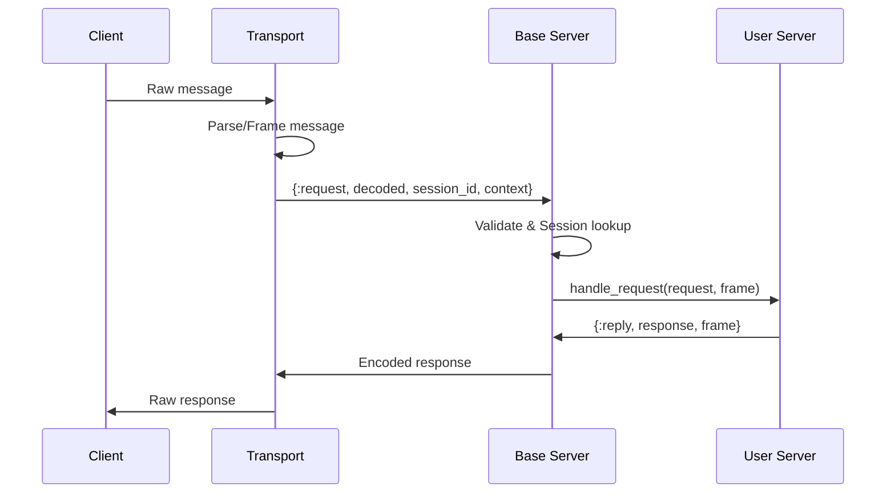

# Hermes Server Architecture

This guide provides a comprehensive overview of the Hermes server architecture, its design principles, and how components interact to implement the Model Context Protocol (MCP).

## Overview

The Hermes server architecture follows a layered design that separates concerns and provides flexibility for different transport mechanisms. At its core, it implements the MCP specification while providing an ergonomic API for Elixir developers.

## Architecture Layers

The server architecture is organized into distinct layers:

### User Layer
- **User Code**: Your server implementation using `Hermes.Server`
- **Components**: Tools, prompts, and resources that define server capabilities

### API Layer
- **Hermes.Server**: Macro DSL that simplifies server creation with declarative syntax

### Core Layer
- **Hermes.Server.Base**: The protocol engine that handles MCP compliance
- **Registry**: Process registry for looking up server components
- **Session.Supervisor**: Manages session lifecycles for HTTP transports
- **Session Agents**: Individual session state containers

### Transport Layer
- **STDIO Transport**: For CLI tools and subprocess communication
- **StreamableHTTP Transport**: For web applications with multiple clients
- **WebSocket Transport**: For real-time bidirectional communication

## Core Components

### Hermes.Server (API Layer)

The `Hermes.Server` module is the primary developer interface. It provides:

- **Macro DSL**: Simplifies server implementation with declarative syntax
- **Component Registration**: Manages tools, prompts, and resources
- **Default Implementations**: Provides sensible defaults for common MCP methods
- **Compile-time Validation**: Ensures server configuration is valid

When you `use Hermes.Server`, it:
1. Injects the behavior callbacks
2. Sets up component registration
3. Provides import conveniences
4. Generates metadata functions (server_info, capabilities, etc.)
5. Delegates actual request handling to the Base server

### Hermes.Server.Base (Protocol Engine)

The Base server is the protocol implementation engine. It handles:

- **Message Processing**: Decodes JSON-RPC messages and routes them appropriately
- **Protocol Compliance**: Ensures MCP specification adherence
- **Session Orchestration**: Creates and manages sessions for HTTP transports
- **Error Handling**: Provides consistent error responses
- **Lifecycle Management**: Handles initialization, shutdown, and state transitions

The Base server maintains minimal state:
- Reference to the user's server module
- Transport configuration
- Session registry (for HTTP transports)
- Server metadata (capabilities, versions)

### Transport Layer

Transports handle the actual communication with clients:



## Message Flow

### Request Processing Pipeline

1. **Transport Reception**: Transport receives raw bytes/text from client
2. **Message Framing**: Transport extracts complete JSON-RPC messages
3. **Base Server Routing**: Transport calls Base with decoded message and metadata
4. **Session Association**: Base attaches or creates session (HTTP only)
5. **Protocol Validation**: Base validates message structure and session state
6. **Business Logic**: Base calls user's handle_request/handle_notification
7. **Response Encoding**: Base encodes the response as JSON-RPC
8. **Transport Delivery**: Transport sends encoded response to client

### Lifecycle Management

The server follows a well-defined lifecycle:

1. **Uninitialized**: Server starts and awaits client connection
2. **Initializing**: Client sends `initialize` request, protocol negotiation occurs
3. **Initialized**: Client confirms with `initialized` notification
4. **Active**: Normal operation handling requests and notifications
5. **Terminating**: Graceful shutdown with cleanup

## Session Management

### Understanding MCP Sessions

Sessions in MCP are **exclusively for HTTP-based transports**. This design reflects fundamental differences between transport types:

#### STDIO Transport
- **No sessions needed**: Process lifecycle = session boundary
- **1:1 relationship**: One client launches one server subprocess
- **Natural isolation**: OS process isolation provides security
- **State persistence**: Process memory serves as session state

#### HTTP Transport
- **Sessions required**: HTTP is stateless by design
- **N:1 relationship**: Multiple clients connect to one server
- **Explicit boundaries**: Sessions provide isolation between clients
- **State management**: Sessions persist state across requests

### Session Architecture

For HTTP transports, Hermes implements a sophisticated session management system where:

- **Base Server** maintains a session registry mapping session IDs to processes
- **Session Supervisor** dynamically spawns session agents as clients connect
- **Session Agents** store per-client state in isolated processes
- **Request Routing** ensures each request reaches the correct session based on the `Mcp-Session-Id` header

### Session Lifecycle

1. **Creation**: First request triggers session creation
2. **Association**: Session ID returned in `Mcp-Session-Id` header
3. **Persistence**: Client includes session ID in subsequent requests
4. **Isolation**: Each session maintains independent state
5. **Expiration**: Sessions expire after 30 minutes of inactivity (configurable)
6. **Termination**: Explicit close, timeout, or transport failure

### Session Expiration

Sessions automatically expire after a period of inactivity to prevent resource leaks:

- **Default timeout**: 30 minutes
- **Configuration**: Set `session_idle_timeout` when starting server
- **Timer reset**: Each request/notification resets the session's expiry timer
- **Cleanup**: Expired sessions are terminated gracefully

```elixir
# Configure custom session timeout
{MyServer, 
  transport: {:streamable_http, port: 8080},
  session_idle_timeout: :timer.minutes(15)
}
```

### Why Sessions Matter

Sessions enable critical features for production deployments:

- **Multi-tenancy**: Isolate different clients on shared infrastructure
- **Stateful Operations**: Maintain context for multi-step workflows
- **Resource Management**: Track and cleanup client-specific resources
- **Security Boundaries**: Enforce access control per session
- **Scalability**: Support load balancing with session affinity


## Frame: Request Context

The Frame is a data structure that flows through request processing, providing a clean abstraction over transport and session details. It contains:

- **assigns**: User data populated by middleware (authentication, authorization)
- **transport**: Connection metadata that varies by transport type
  - HTTP: headers, query params, IP address, scheme, host, port
  - STDIO: environment variables, process ID
- **private**: MCP session data (session ID, client info, protocol version)
- **request**: Current request being processed (ID, method, params)

The Frame flows from transport → Base Server → User Server → Components, accumulating context at each layer while maintaining immutability.

## Supervision Tree

The supervision strategy ensures fault tolerance through a hierarchical process structure:

**Application Level**
- Registry (global process registry)
- Server Supervisor (manages server instances)

**Server Level** (under Server Supervisor)
- Base Server (protocol engine)
- Session Supervisor (DynamicSupervisor for sessions)
- Transport (communication layer)

**Session Level** (under Session Supervisor)
- Individual session agents spawned dynamically
- Isolated processes with `:transient` restart strategy

This architecture provides:
- **Fault Isolation**: Session crashes don't affect other sessions
- **Resource Cleanup**: Automatic cleanup on process termination
- **Restart Strategies**: Transient restarts for recoverable errors
- **Graceful Shutdown**: Ordered termination sequence


## Error Handling

Hermes provides structured error handling through the `Hermes.MCP.Error` module with standardized categories:

- **Protocol Errors**: JSON-RPC violations, invalid requests, method not found
- **Transport Errors**: Connection failures, send failures, timeouts
- **Domain Errors**: Business logic failures from your server implementation
- **Client Errors**: Invalid parameters, unauthorized access

Each error includes:
- Standard error code (following JSON-RPC conventions)
- Human-readable message
- Optional additional data for debugging

Errors are automatically formatted as proper JSON-RPC error responses and logged with appropriate severity levels.

## Performance Considerations

### Optimization Strategies

1. **Process Hibernation**: Reduce memory footprint for idle processes
2. **Lazy Session Creation**: Only create sessions when needed
3. **Efficient Message Routing**: Direct routing without intermediate processes
4. **Batch Processing**: Support for JSON-RPC batch requests (2025-03-26+)

### Scalability Patterns

For production deployments:

- **Horizontal Scaling**: Multiple server instances behind load balancer
- **Session Affinity**: Sticky sessions for stateful operations
- **Resource Pooling**: Shared resources across sessions
- **Monitoring**: Telemetry events for observability


## Related Documentation

- [Server Components](server_components.md) - Building tools, resources, and prompts
- [Server Quick Start](server_quickstart.md) - Getting started guide
- [Server Transport](server_transport.md) - Transport configuration details
- [Error Handling](error_handling.md) - Comprehensive error handling guide