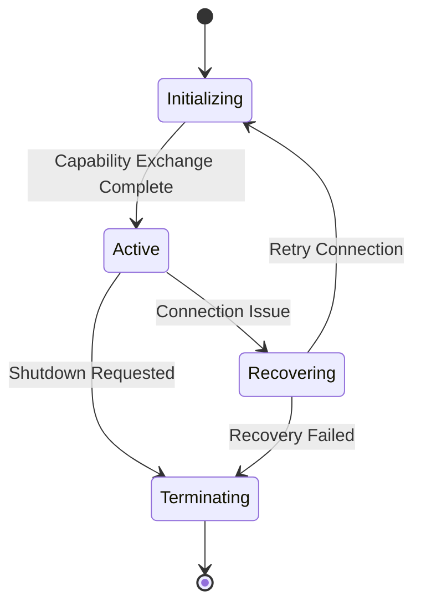
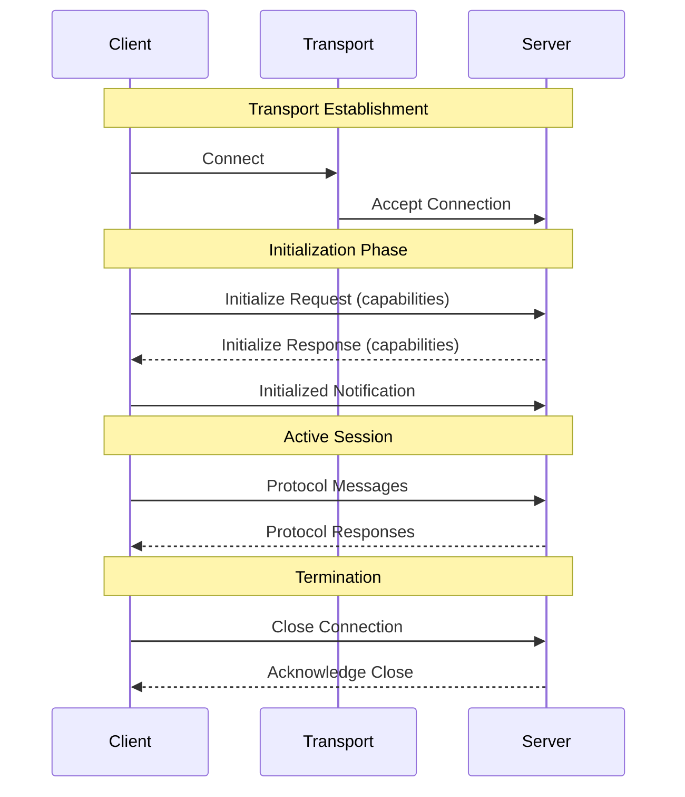

# RFC: Elixir MCP Library – Unified Client and Server with Phoenix Integration

## 1. Introduction

This document defines the design and architecture of an Elixir library that implements both the client and server aspects of the Model Context Protocol (MCP). The goal is to provide a unified solution that supports robust JSON‑RPC 2.0 communication, leverages Elixir's concurrency and fault tolerance, and integrates seamlessly with Phoenix for server operations. The library will expose a high‑level client API that abstracts transport details and a server API that is compliant with Phoenix conventions for building HTTP endpoints. The design is modular, extensible, and structured to support future enhancements.

For further context on MCP, see the [Anthropic announcement](https://www.anthropic.com/news/model-context-protocol) and the [Glama Quickstart](https://glama.ai/blog/2024-11-25-model-context-protocol-quickstart).

---

## 2. Library Architecture Overview

### 2.1 General Structure

The library is divided into two main components: the Client and the Server. Both components share core infrastructure for JSON‑RPC handling, configuration, and error management. The Client is designed to provide a high‑level API that abstracts connection management and messaging details, while the Server exposes MCP functionality through Phoenix‑compliant endpoints.

A central configuration module governs the behavior of both components, allowing runtime customization of timeouts, protocol versions, and transport preferences. Middleware hooks are provided at strategic points to support additional processing such as authentication, logging, or transformation.

### 2.2 Core Components

At the lowest level, a transport abstraction layer decouples the specifics of STDIO, HTTP, or other transports from the core logic. The connection manager (implemented as a GenServer) oversees the client's lifecycle, including the initialization handshake and message correlation. For the server, a dispatcher module routes incoming JSON‑RPC messages (received via a Phoenix controller or Plug) to the appropriate tool handler registered in a tool registry. These components are organized under a comprehensive supervision tree to ensure fault tolerance and automatic recovery.

---

## 3. Protocol Lifecycle Management

The Model Context Protocol defines specific lifecycle requirements that both clients and servers must implement. Our Elixir library provides unified lifecycle management that serves both roles through shared infrastructure while maintaining clear separation of concerns.

### 3.1 Shared Infrastructure 

The library implements the protocol lifecycle through a state machine that governs connection establishment, message exchange, and termination. This shared infrastructure leverages Elixir's GenServer and supervision capabilities to provide robust state management and fault tolerance regardless of whether the library is operating in client or server mode.

### 3.2 Client Lifecycle

When operating as a client, the library actively initiates and manages connections to MCP servers. The client connection manager handles the following responsibilities:

The client begins by establishing a transport connection and sending an initialization request containing its capabilities and protocol version. Upon receiving the server's capability response, it validates compatibility and transitions to the active state. Throughout the session, it maintains correlation between requests and responses while monitoring connection health.

During recovery scenarios, the client connection manager attempts to reestablish the transport connection and reinitialize the protocol session. It provides configurable retry policies and transparent recovery when possible.

### 3.3 Server Lifecycle

As a server, the library acts as a passive participant in lifecycle management, responding to client initiatives while maintaining session isolation. The server session manager creates dedicated processes for each client connection, ensuring proper resource cleanup on termination.

When receiving a client's initialization request, the server validates the protocol version compatibility and responds with its supported capabilities. It then maintains session state for the connection, tracking active subscriptions and managing resource access. The server uses Phoenix's connection management facilities when operating over HTTP/SSE transport.

### 3.4 Lifecycle Integration

The following sequence diagram illustrates how the client and server components interact during a typical protocol lifecycle:

### 3.5 Error Management

The library implements comprehensive error handling for both client and server roles. Errors are categorized into:

Protocol Errors: Version mismatches or capability incompatibilities are handled through standardized error responses that maintain protocol compliance.

Transport Errors: Connection failures trigger appropriate recovery mechanisms based on the component's role. Clients attempt reconnection while servers clean up affected sessions.

Application Errors: Errors during tool execution or resource access are propagated through the protocol's error reporting mechanisms while maintaining session stability.

This unified approach to lifecycle management ensures protocol compliance while providing robust operation in both client and server roles. The library's supervision strategies and process isolation enable reliable recovery from failure scenarios while maintaining proper resource cleanup.

## 4. Engineering Considerations

### 4.1 Client Implementation

The client's core responsibility is to manage the connection and message exchange with an MCP server. A GenServer will serve as the connection manager, maintaining state (such as pending message IDs and associated callbacks) and handling the initialization handshake. The transport layer will be defined by a set of behaviors, which will allow developers to implement additional transport modules (e.g., STDIO or WebSocket) without modifying the core client logic. Error handling is performed through standardized mappings to Elixir's error tuples, and configurable timeouts are implemented to avoid blocking calls.

### 4.2 Server Implementation

For the server, Phoenix integration is a primary design goal. The library will provide a Plug/Phoenix module that acts as the HTTP interface for MCP. Incoming JSON‑RPC messages are first parsed and validated, then dispatched to the correct tool handler as registered in the tool registry. The dispatcher module uses asynchronous Tasks to invoke tool handlers, ensuring that long‑running operations do not delay the overall request-response cycle. Session management is achieved by isolating client interactions within dedicated processes, which allows the server to maintain state and context for each connection independently. Additionally, extensive logging and observability hooks are built in to facilitate debugging and performance monitoring.

### 4.3 Shared and Extensible Architecture

Both the client and server components share a common configuration module that reads settings from Elixir's configuration files (e.g., config.exs). Middleware hooks are available for both sides, enabling developers to insert custom authentication, logging, or transformation logic into the processing pipeline. The design adheres to a strict supervision tree structure to automatically recover from process failures and to maintain high availability. This shared architecture not only simplifies maintenance but also ensures that future enhancements can be integrated with minimal disruption.

## 5. Roadmap for Version 0.1.0

The roadmap for version 0.1.0 focuses on delivering a robust and well-tested client interface before expanding to full server functionality.

### 5.1 Phase 1: Design and Requirements (Weeks 1-2)

During this phase, a detailed design document is created based on the MCP specification. This includes defining the minimal set of features for the client, specifying the public API functions (connect/1, request/2, notify/2), and designing the transport abstraction layer. Prototypes for the connection manager are built and validated against simulated MCP server responses.

### 5.2 Phase 2: Core Client Module Implementation (Weeks 3-5)

In this phase, the core client module is developed. The connection manager GenServer is implemented, handling the JSON‑RPC handshake and managing state for pending requests. Basic error handling and timeout logic are integrated, and unit tests are written for each component. The transport abstraction is implemented initially for STDIO, with a clear interface for future extensions.

### 5.3 Phase 3: Transport Abstraction and High-Level API (Weeks 6-7)

The focus shifts to refining the transport abstraction layer, ensuring that it supports multiple transport mechanisms seamlessly. The high‑level client API is finalized to provide idiomatic functions that hide low‑level details. Documentation is updated with usage examples and configuration guidelines.

### 5.4 Phase 4: Integration Testing and Documentation (Weeks 8-9)

Comprehensive integration tests are performed by simulating connections to a basic test MCP server. Detailed documentation, including API reference guides and example applications, is produced. Performance metrics, logging outputs, and error scenarios are verified to ensure that the client component meets production standards.

### 5.5 Phase 5: Beta Release and Feedback (Week 10)

A beta version of version 0.1.0 is released to early adopters. Feedback is collected regarding usability, stability, and performance. Based on this feedback, necessary adjustments are made before finalizing the release. This phase sets the stage for subsequent versions that will incorporate full server functionality with Phoenix integration and additional transport support.

## 6. Conclusion

This RFC has outlined the complete technical design for an Elixir MCP library that provides both client and server capabilities. The public API is designed to be high‑level for the client—abstracting connection and message handling—and fully compliant with Phoenix for the server side. The document details the architecture, internal flows, and the phased roadmap for version 0.1.0, focusing initially on establishing a robust client interface. The modular, extensible design ensures that the library can evolve to support additional features such as dynamic tool registration, middleware enhancements, and alternative transport mechanisms.

## References

1.	Introducing the Model Context Protocol – Anthropic
2.	MCP Quickstart – Glama
3.	Model Context Protocol – Linkup